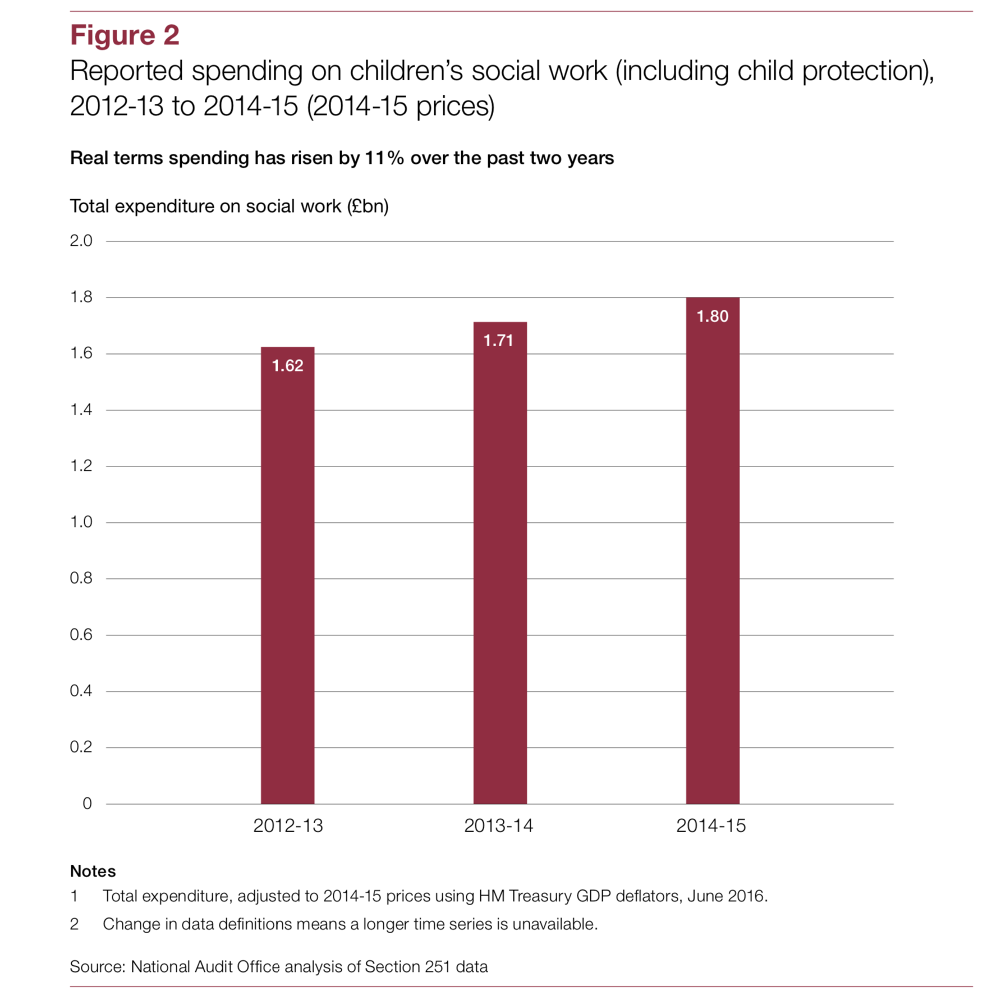
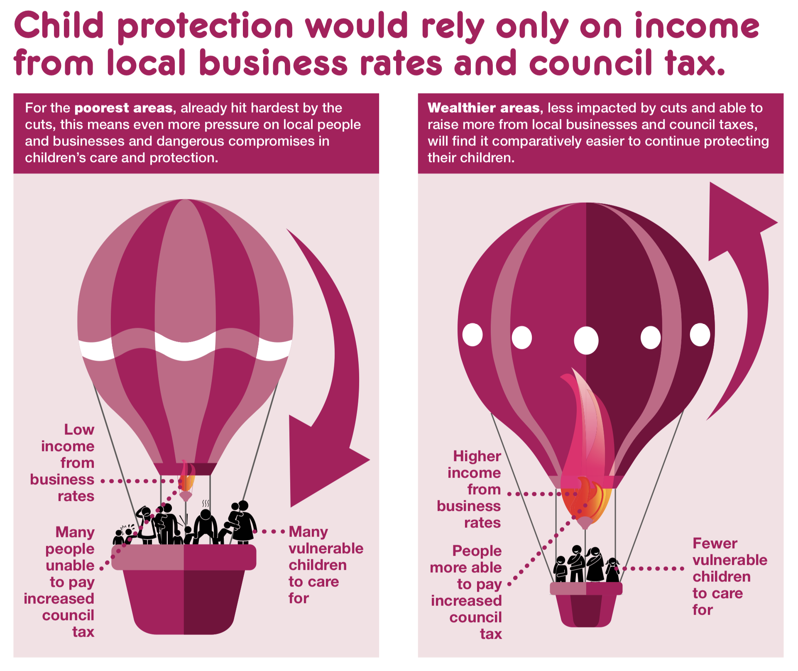

# Where's all the money gone? Funding children's services over the 2010s.

## Crisis and austerity

The global financial crisis of 2008 was followed by the introduction of 'austerity', government budget policies of cutting public sector spending, in many countries in Europe, including the UK.[@callan2011distributional; @callan2011distributional] The logic of austerity was largely backed by two things, firstly, a 'common-sense' narrative that governments had been acting irresponsibly, or inefficiently, by accruing debt or over-spending on public sector services, and that it was irresponsible for a government to increase spending when they had large outstanding debts; that we had all benefitted from 'overspending' and now we had to share the burden of 'tightening our belt'.[@blyth2013austerity; clarke2012alchemy] Secondly, two economists claimed to have found a tipping point in economic growth, where countries with higher spending on public services had significantly lower growth.[@reinhart2010growth]   

It is now broadly understood that the greatest contributor to the financial crisis wasn't public services spending or irresponsible individuals taking on more debt than they could manage, but mortgage lending practices and debt management behaviours by banks in the United States and globally.[@lancaster2010whoops] An over-simplication is that banks continued to increase their debts to 20 or 30 times their equity (their value - income and assets), which included derivatives - promises of future income largely from risky mortgages - that had been 'packaged up' in such a way to obscure how risky and unsafe they really were.[@lancaster2020whoops; @mark2010uncontrolled] This, combined with economic forecasting models that were useless for detecting 'Black Swan' events[@taleb2007black; @taleb2009six] - events that had never happened before or were so incredibly rare that they could not be statistically modelled and predicted - and other factors, led to a perfect storm of corporate irresponsibility, false confidence, and a total blindness to the looming risk. When house prices began to fall in the United States, the entire global economy crashed. Many businesses with high debts were 'too big to fail', their bankruptcy would have resulted in thousands of millions of people linked to them to lose their jobs or savings, meaning that governments had little choice but to bail them out to prevent further economic collapse, or let them fail and deal with the much larger fall out, likely while other countries bailed them out and would subsequently gain an advantage in the international economy.

Video 2: https://www.youtube.com/watch?v=YoD-EEBjVUs
Video 3: https://www.youtube.com/watch?v=go2bVGi0ReE 

Governments across Europe, and central not governmental organisations like the EU Central Bank, responded to the increased debt from bailouts and the undetermined causes of the financial crisis with packages of fiscal austerity. These were implemented particularly brutally in the United Kingdom, and the personal responsibility narrative, combined with the accusations that excessive public spending was the cause of the global financial crisis, created the conditions where people living in poverty and claiming benefits were blamed by many for crashing international financial markets. This was especially true of poor mothers and disabled people, who were accused of abusing the welfare system and driving up public debt,[@jensen2013austerity] despite there being virtually no evidence of any kind of 'benefit-reliant' type of household. [@hills2017good] Bankers caused the crisis, but everyone else paid for it.[@jones2018whose] More than this, welfare recipients with a heavy voting bloc, like pensioners, had their public services protected somewhat through policies like the triple-lock on pensions. By contrast, children, who have no voting power, were easy targets for spending cuts.[@webb2018austerity] Even if this was wrong, surely, based on what the economists above found, it would only be for a limited time - right?

Unfortunately, it later turned out that the research by the two economics cited earlier had both technical and methodological flaws that together completely invalidated their results.[@herndon2014does; @bell2015stylised] The economists, Reinhart and Rogoff, omitted certain data, used a sensitive averaging method, and had a spreadsheet data[@herndon2014does] and, on top of this, they failed to account for the fact that different countries would have different relationships between public debt and economic growth.[@bell2015stylised] Austerity and strict control of public spending was never going to improve economic recovery, but by the time the economic argument had been translated into the political sphere it was too late. 

The blame of poor families and children and the idea that we needed to 'tighten our belts' for a limited time to help the economy recover fit with the 'common sense' argument for austerity that had been so successful in the 2010 and 2015 elections. The common sense logic of austerity took on a life of its own, becoming more belief than fact. It revitalised narratives of 'deserving' and 'undeserving' welfare claimants, and the policing, scrutinisation and stigmatisation of individuals and families claiming welfare support they were entitled to among agencies, and became a function of the 'concerned citizen' who was further legitimised in their actions by 'protecting sovereign finances'.[@briant2013reporting; @baumberg2016stigma; @chase2013co] Austerity became a relational and fiscal reality.

*The roles we play video*

But at the time of austerity budgets, George Osborne had made promises that children's services would be protected. Was that true and what really happened?

## How has the funding of children's services in England changed since 2010?

### The protection of children's services?

> "But Mr Speaker, we want to ensure that low income families with children are protected from the adverse effects from these essential savings. [...] Sure Start services will be protected in cash terms, and the programme will be focused on its original purpose. [...] Overall, the Department for Education will be required to find resource savings of only 1% a year. Central administration will be cut by a third and five quangos will go. I repeat - the resource money for schools, the money that goes into the classroom - on the broadest definition, including all the main grants, will go up in real terms every year." 
> George Osborne, [20th October 2010 Spending Review](https://www.bbc.co.uk/news/uk-politics-11585941)[@bbc2020spending]

The Chancellor of the coalition government at the time had implied that children's services spending would be largely protected, or, in any case, that children in low-income families would not be adversely affected by the austerity measures proposed and later implemented. But was this the reality? At the time, alarm bells were clearly ringing in regards to what was not said in the Chancellor's speech, notably that the non-schools component of the central grant to local authorities was no longer 'ring-fenced'. 

In response, experts in the sector were explaining that the unprotected status of the non-schools budget alongside statutory safeguarding responsibilities and local authority requirements to cut spending would lead to an inevitable retrenchment in the services available to children and families. Fiona Blacke, then CEO of the National Youth Agency, explained: "the biggest question for my sector must be the impact of cuts in local government support from central government and the removal of ringfencing of key budgets. We already know [...] that cuts are already biting in voluntary and statutory provision for young people. Now it is going to be down to communities and local elected members to determine where the axe falls locally." Maggie Jones, then chief executive at Children England, commented: "The cuts proposed to the non-schools budgets in the DfE settlement amount to some 12 per cent and are among the most severe of any government department [...] This will impact on preventative work, safeguarding, children in care, youth services and family support. When these are combined with the knock-on effect from the cuts in welfare, the 28 per cent cut for local government and budget pressures in the NHS the future looks very bleak for some of the most vulnerable children and families; the very people the coalition government promised to protect."[@cypnow2010expert] Children England's position and analysis was later cemented in their *Perfect Storms* report.[@davies2012perfect]

Later, Kakabadse, et al. explained how these conditions were likely to affect children's services:

> "Whilst the approaches that local governments take to making savings vary significantly from authority to authority, the general principle that they must economise financially, either at a service, a directorate or an organisational level, is a common theme from which there seems to be no protection for children's services. The probable consequence, therefore, is a reduction in some of the services available to children and families that, given the non-statutory nature of many early intervention and prevention services, is likely to result in the greatest reductions in these areas in order to preserve the statutory specialist and intervention services." 
> Kakabadse, et al. (2014: 93)[@kakabadse2014what]

Were these academics and representatives of the sector right to raise the alarm? The National Audit Office's report on children's services expenditure initially seemed to support the governments claim that they had protected children's services spending broadly. They stated, in no uncertain terms, that spending on children's social work had increased by 11 per cent in real terms and that there was 'no correlation' between money spent, Ofsted ratings, and children in need rates in local authorities.[@nao2016children] Specifically, they stated:

> "Average spending on a child in need has increased slightly in the past three years. [...] This spending was equivalent to £2,300 per child in need, compared with around £2,200 per child in 2012-13 and 2013-14. [...] Average spending on each child in need varies widely across England and is not related to quality." 

This included the following graph:

fig.cap = page 14

But already the cracks were beginning to show in the delivery of services and the experiences of social workers and other public sector workers. In the Joseph Rowntree Foundation's report, *The Cost of the Cuts*, one time joined-up multi-agency services began to show their fragmentation.[@hastings2015cost] Housing officers expressed their inability to secure mental health and adult social care support for families at risk of losing their housing because their needs did not meet thresholds that had been established to manage demand for services. This was a two-way street, where social workers similarly could not leverage the support around practical needs of families that they were once able to, and were saddled with more and more desk-based work that had increased as 'back-room' staff were made redundant to cut costs. The same narratives continued to come up around the adverse effects of cost-saving on social workers' abilities to do their job in the ways they knew worked, and the pressure that rationing of reduced services and funding had.[@morris2018social; @devaney2019trouble]

The Child Welfare Inequalities Project played a small part in cracking the veneer of 'protected' children's services. In 2018, we published 'Austerity, rationing, and inequity: trends in children’s and young peoples’ services expenditure in England between 2010 and 2015'.[@webb2018austerity] In this paper, we questioned why it was that the National Audit Office had developed a grouping of 'social work' spending that lacked such transparency that we were unable to replicate it. We also questioned why they had chosen 'children in need' rather than any other denominator to average spending per child, since a child can't possibly be 'in Need' under Section 17 of the Children Act 1989 before they have had some kind of service involvement. We wondered what possible relevance looked-after children spending had to children in need, and why on earth the National Audit Office had chosen to start their analysis at 2012-13 rather than 2010-11, when the cuts started.

### The veneer cracks: what really happened.

What we found was a picture identical to that which Maggie Jones, Fiona Blacke, and Nada Kakabadse described in 2010 and 2014 respectively. Children's services had not been protected, far from it. They had been subject to substantial and inequitable cuts. We found that any increase in spending that could be described was solely the result of rising costs of caring for children taken into care, of which there were more children to care for and ever-growing costs, especially as the provision of fostering services became increasingly privatised.[@jones2018whose] Once spending was broken down into broadly stable categories over time, it turned out that all other provisions had been either stable or had decreased dramatically. Spending on 'safeguarding', broadly capturing social work staff costs and costs associated with commissioning services, had remained stable. Of course, 'stable' in this context really means that its value was decreasing year-on-year as complex caseloads and children entering care increased. The real victim of the cuts was everything else, the bulk of which was the funding associated with children's centres (including Sure Start) and family support. This spending had been reduced more than 40 per cent per child over the five years since 2010. Below is a graph showing the changes in spending per child based on the original paper, and extended to include data up to 2018-19.

*Area plot of spending per child*

We also found, as you can see above, that the cuts to these services were not equal across local authorities. The inequities in cuts were distributed in such a way that they fell most heavily on the poorest children living in the poorest areas. The poorest 50 local authorities had cuts to their early help and family support services that were on average 1.5 times greater each year than they were in the least poor 50 local authorities. Needless to say, there were other entangled injustices associated with this inequality - Black and ethnic minority children are disproportionately over-represented in the populations of these poor local authorities;[@platt2007poverty; @platt2019understanding] the majority of the poorest local authorities are Labour controlled;[@rae2019ranked] and how David Cameron's government implemented a policy to 'take over' and open to the market any local authority children's services that did not improve on an 'inadequate' Ofsted rating within six months.[@jones2018whose]

But what about the fact that the NAO found there was no association between spending and outcomes anyway? If this were true, it shouldn't really matter how spending had changed over the last decade. In fact, this narrative was so widely believed that Sir Michael Wilshaw, then Chief Inspector at Ofsted, said in the regulatory body's 2016 report on children's services that:

> Our inspectors have seen this across the country and we now know that: Inadequacy is not a function of size, deprivation or funding, but of the quality of leadership and management.
> Michael Wilshaw, Ofsted, 2016: 5, quoted in Lavalette, 2019: 28[@lavalette2019future]

We found flaws with the National Audit Office's assertion that spending was not associated with the quality of children's services.[@bywaters2017ofsted] The NAO's analysis did not critically compare similarly deprived local authorities when analysing their Ofsted ratings, meaning that the fact that the most deprived local authorities, which usually have far more complex cases requiring higher funding, was absent from consideration. We found that: "high deprivation LAs that did get a good or outstanding judgement spent more money than those judged inadequate. The population weighted average spend in those judged good was £1293 per child; when judged inadequate it was £993, a difference of 23%. [...] Some high deprivation LAs may not have enough money to secure a good outcome."

Additional research has since been undertaken that looks specifically at the relationship between early help and family support spending, the spending that had been cut the most drastically, and children in need rates. This research is currently under peer review with an academic journal, but found that each £20 invested per child in a local authority in a given year was associated with a 1 per 10,000 reduction in Children in Need rates the following year.[@webbforthcomingdefence] The reason that previous comparisons have failed to show this kind of effect is likely due to the fact that they do not adjust for the fact that spending and children in need rates reflect different measurements within different local authority contexts. For example, Section 17 of the Children Act may be interpreted differently in some places than others, and some components of family support or children's centres may be logged  differently in spending returns depending on the local authority they come from. This new analysis adjusts for these between-local authority differences to get a better estimate of spending effects. 

The National Audit Office and Ofsted have conceded some ground on their position on the impact of deprivation and spending on intervention rates or quality. They have since referenced the findings we wrote about above, as well as broader findings from the Child Welfare Inequalities Project, but still contend that deprivation only accounts for around 15 per cent of local authority intervention rate variation and that the evidence on the effect of spending is mixed.[@nao2019pressures; @ofsted2017annual] By contrast, our recent research estimates that around 75 per cent of differences in looked-after rates and almost 50 per cent of differences in child protection plan rates between local authorities can be explained by underlying deprivation[@webb2020income] and that rates of children in need would be approximately 21 per cent lower in 2019 if funding had stayed at 2010 levels.[@webbforthcomingdefence] For many children and families the damage is already done and the services they, and their social workers, have historically relied on have been demolished. 

The belief that funding is not a correlate of service quality has been firmly engrained, the latest Children's Minister, Nadhim Zahawi, had reiterated the idea espoused by Michael Wilshaw in his position at Ofsted in 2016 as recently as 2018, saying that strong leadership, rather than extra funding, was key to 'turning around failing children's services'.[@brindle2018nadhim] Countering this narrative is why it's so important for social workers to be aware of the latest evidence on children's services funding, to have a clear operational model of how it works, and have access to the research that shows its impacts. This is essential for social workers to stand up for the best interests of their profession and for the families they work with. It starts with understanding what has happened to children's services funding where you work.

**BOX: Exploring how austerity has changed in your local authority**

## Fixing the damage of the austerity decade

### The consequences of changes to funding on child protection

Video: https://www.youtube.com/watch?v=2ml1CCP5LKg&feature=youtu.be

As the testimony given to the All Party Parliamentary Group on children's services funding alludes to, austerity and the reduction in family support, both to families and to services, alongside other structural narratives about social workers' 'failings' in relation to serious case reviews, growing privatisation and profit-making incentives in foster care, and changes to Ofsted rating criteria, have created a complex vortex that creates ever growing need and more and more intensive interventions, including child protection plans and children taken into care. *Children England* summarise this complexity in their [*Perfect Storms*](https://www.childrenengland.org.uk/Handlers/Download.ashx?IDMF=a62fd6aa-4484-44dc-8935-9fab9813c046) report,[@davies2012perfect] page 19, and they also summarise the ways that changes in government central funding decisions are affecting local councils unevenly. 

Children England's balloons
 [@darlington2017dont]

Subsequent to the 'running down' of the central government non-schools funding grants, different local authorities are in more unequal positions to meet the needs of their children and families. The government expectation has been for local councils to replace their lost funding with revenue raised through local taxes, such as council tax. The obvious problem with this is that the most deprived local authorities will have far more people in receipt of council tax relief and, were they to implement any progressive taxes, far less income from these. They will also likely have lower forms of other taxes, like business rates, and less flexibility to change these. At the same time, there are more families that require support and the kinds of support that is needed is more likely to be complex in nature. This combination of factors creates the 'hot air balloon' effect that *Children England* illustrate,[@darlington2017dont] where the most deprived places have been the least able to weather the storm of funding cuts, as we saw above.

*Add graph that shows intervention rates growing in contrast to funding falling*

The consequence of this is likely that inequitable reductions in funding have contributed to the growing rates of children on child protection plans and placed in care that we see over the last decade. One of the ways we can highlight this is by observing the rare few councils that have resisted pressure to cuts their early help and family support services or who have reversed these cuts, to whatever extent possible, in recent years. There are two such case study examples that reflect the former and the latter changes, the Camden Borough of London and the Glasgow City Health and Social Care Partnership.

**Box case studies: Camden and Glasgow**

**Disclaimer:** These case studies have been written based on publicly available data about the local authority/health and social care board. They are not necessarily reflective of the local government organisations' own interpretation of the data and have not been endorsed by them or developed with them formally. They should not be taken as precise estimates, especially when this relates to cost savings from children looked-after reductions. Averages are used where possible but the profile of the reduction in children in care and the kinds of support they need is not known, and therefore more precise costs cannot be calculated. Many children looked-after in Scotland also remain with their birth family, which may mean that estimates of effects are inflated when comparisons are made with English local authorities. While the causal effect has been identified in the new research, there are also likely other factors unrelated to early help and family support spending that can explain councils' reductions in intervention, including express commitments from leaders to pursue this. These case studies are intended to be illustrative only and aim to demonstrate why greater investment in early help and family support should be seriously considered as a mechanism to reduce child protection and child removal interventions.

### Camden [@webb2020app; @camdenNDearly]

The London Borough of Camden has been a significant outlier in terms of its spending on Early Help and Family Support and in its trajectory in children looked-after rates. Its total spending on non-safeguarding, non-looked-after services has fluctuated between around £30million and £36million between 2010 and 2019, adjusting for inflation. This is particularly unusual for a mid-to-high deprivation local authority, nearly all of which have cut their early help and family support services.[@webb2018austerity] 

Since 2016, Camden has had the highest spending per child on family support and early help of any local authority in England. At the same time, Camden have reduced their rates of children in care every single year since 2011: from 73 per 10,000 in 2010-11 to 37.5 per 10,000 in 2018/19, a reduction of almost half. They were one of only 48 local authorities to see decreases on average each year rather than increases. More than this, Camden has actually seen the second highest average yearly reduction in children looked-after rates in the entire country (-4.66 per 10,000 per year), and Camden's yearly reductions have been far more consistent than the local authority with the highest yearly reductions, Haringey (-4.86 per 10,000 per year). Camden's per year reduction was more than 3 times greater than the average for the 48 (-1.49 per 10,000 per year). One of the consequences of this is that Camden has been able to keep its total spending on children looked-after very stable. The average local authority in England saw their total spending on children looked-after increase from around £23million in 2010-11 to £32.5million in 2018-19. By contrast, Camden's spending has fluctuated between £19.2million and £30.7million over the decade, rather than increasing in one direction, with the last 5 years of the decade being between £23million and £25million. Overall, Camden's total children looked-after spending is about £2million higher in 2018-19 than it was in 2010-11, compared to the average £9.5million higher in all local authorities on average.

In 2018-19, Camden's child population was estimated to be around 51,000 and their average spend per child looked-after was £124,000 per year, 175 times higher than the cost per child on early help and family support. Based on this, we might estimate that Camden had 175[^The fact these are both 175 is coincidence.] fewer children looked-after in 2018-19 than it otherwise would have had if rates of children in care had stayed at their 2010-11 levels. This would have carried an additional associated cost of £21.7million per year, almost doubling what Camden's looked-after children spending currently is and being about ten times more than the actual increase they in children looked-after costs that they experienced.

This has been possible in part due to Camden Council's commitment to early help and family support services. Stemming from Camden Resilient Families, the Camden Social Work Model saw the council provide a well-resourced (relative to the rest of the country) early help service that includes a range of support, designed to reimagine family support as a way to actively promote the welfare of children, not just protect them from harm. This includes dedicated early help coordinators and longer term (6 months plus) support, enabling family workers to develop relationships with families and identify effective solutions to their problems in partnership with them, through practices like family group conferencing. Crucially, this includes being meaningfully connected with wider forms of community support and community organisations in a way that is only possible with long-term investments and commitments. These organisations and collective groups often respond to families' practical needs, many of which are associated with poverty: food, clothing, laundry, fuel, loneliness, and participation in cultural events.[@townsend1979poverty; @dove2020someone] 

Camden's approach reflects an implementation of social work theory that enables families and children to flourish, on their own terms with respect to their feelings and desires.[@white2014re; @featherstone2018protecting] It often targets the social determinants of family conflict before problems develop but, importantly, the service does not appear to be *prescriptive* about this remit - the resources and support offered are largely family-centred and family-led. The focus is on the relationship between the family, the worker, and the problem, not on the specific therapy on offer or its effectiveness. The service has increased social services contact with families but this increased contact has not translated into greater statutory intervention into family life, as is often the case, with referral rates, children in need rates, and children looked-after rates all falling by at least 40% since 2010-11. Although there has been an increase of around 25% in Child Protection Plan rates since 2014, rates are still below what they were in 2010-11.

<!---- This contrasts with, say, councils that might follow prescriptive delivery of services based on particular types of evidence, e.g. the Early Intervention Foundation's randomised controlled trial evidence-base of early intervention.[@allen2011early; @white2014re; @wastell2017blinded] Its provisions reflect an inclusive mixture of what some have called 'ordinary help', over medicalised/professionalised help, a rarity, especially in the last ten years but certainly at least since the New Labour reforms to children's services.[@white2014re] This kind of support rarely conforms to the strict, and sometimes unethical within the context of social work, dictates of the randomised controlled trial, and is therefore under-supported or mischaracterised in evidence reviews.[@stewart2011should; @stewart2012more] In *'In Defence of Ordinary Help'*, I have argued that it is precisely this diversity and fluidity of support that allows for a successful 'ecosystem' of early help.[@webbforthcomingdefence] --->

An overview of Camden's Early Help services from Lily, a young person who completed work experience with Camden's children's services
https://www.youtube.com/watch?v=w8zcLkK-5Ks&feature=emb_title

You can find out more about the Camden model of social work [here](https://www.camdenchildrenssocialwork.info/pages/camden-model-of-social-work).

### Glasgow[@cpcgNDimprovement; @glasgowNDintegrated; @burnsNDtackling; @mckennaNDfamily; @scotgovNDchildrens]

Glasgow City Health and Social Care Partnership implemented a strategic plan to improve children's services, reduce the numbers of children in care, especially those placed outside of the city, and to address the role that poverty was having on entry into the child protection system in 2017. Key to this was identifying 'failure demand' in their service ecosystem, and the fact that families were becoming increasingly unable to secure the early help and support they needed and being pulled into the child protection system as a final resort, either after problems had escalated or because they had nowhere else to turn. Before implementing the plan, Glasgow had the highest rate of children looked after in Scotland, even after controlling for child deprivation, at around 327 children per 10,000. The city's Children and Young People’s Integrated Service Plan 2017-2020 saw a renewed commitment to providing early help and family support, especially to address the root causes of child neglect associated with poverty, referencing the Child Welfare Inequalities Project.

Glasgow committed to redirecting funding to early intervention and family support programmes in the plan, as part of this investing an additional £1.98million into early intervention, prevention, and family support into the city (around £7 extra per child in Glasgow per year of the three year plan). This was a significant increase in spending on these kinds of services, with the explicit aim of a whole-city approach to tackling neglect and its association with poverty (1 in 3 children are living in deprivation in Glasgow).

By 2018-19 the rate of children looked after in Glasgow had reduced to around 250 per 10,000, an enormous reduction of just over 23% in three years. This would have translated to around 770 fewer children in care, based on the Glasgow child population. While there are few good estimates of the costs associated with care, the CWIP App estimates for England that the average cost in a local authority is around £65,000 per child per year. At this approximation, we could then estimate that Glasgow's integrated plan and £1.98million of additional funding to early intervention and family support saved around £50million per year in children looked-after costs - not to mention the non-financial benefits of keeping families together and providing them adequate support. Even if the costs associated with care were as low as the lowest costs in a local authority England in 2018-19 (North East Lincolnshire at £36,252 per child per year), the savings would still have been around £27.9million per year, 14 times greater than the largest 3-year additional contribution of spending in the plan.

Exercise:

1) Using the diagram on page 19 of the [*Perfect Storms* report from Children England](https://www.childrenengland.org.uk/Handlers/Download.ashx?IDMF=a62fd6aa-4484-44dc-8935-9fab9813c046), identify and describe how Camden or Glasgow's child welfare interventions (demand for services) may have changed because of changes in the operating conditions for their children's services. Use one or two examples to explain how the case studies fit with the *Perfect Storms* model.

2) Using the patterns you looked at in the previous exercise, analyse how this might apply to the children's services where you live or practice. What pressures might we expect to see emerge because of changes in funding and is this what the data appears to be showing? If not, why might this be?

**END BOX**

The remainder of this resource will explore some of the ways that children's services have been defunded and their consequences, including what social workers might do to resist this direction of travel. This includes understanding the ways that funding formulas operate, and the current campaigns for funding formulas that can drastically change the operating conditions of social work. We will review the ways that social workers, and other public sector workers, respond to cuts through rationing as well as the ways that cuts operate in political manoeuvres to undermine the social work profession and transition more responsibilities to less- or un-accountable private actors. Lastly, we will consider how the cuts and ongoing changes to children's services have dramatically reshaped the type of support available to children and families in both spirit and affordability.

### The funding formula

### Rationing as a rational response

### Cut-denigrate-privatise

### Ordinary help or early intervention?

## Case study